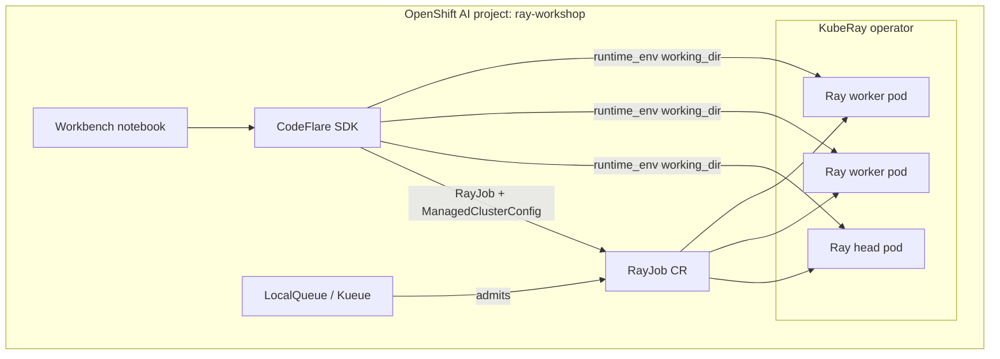

# Architecture

## Data flow (Ray Data lab)

1. Participant clones `ray-workshop` into workbench storage.
2. CodeFlare `RayJob` packages the repo via `runtime_env.working_dir`.
3. `scale_data.py` reads `extras/data/iris.csv`, adds `petal_area`, writes Parquet to `/tmp/ray-workshop-output/iris/`.
4. KubeRay tears down the ephemeral cluster when the job finishes.

## Facilitator YAML path (optional)

Under `configs/facilitator/`, manifests use ConfigMaps and PVCs for smoke tests without a workbench. Participants do **not** use this path.
